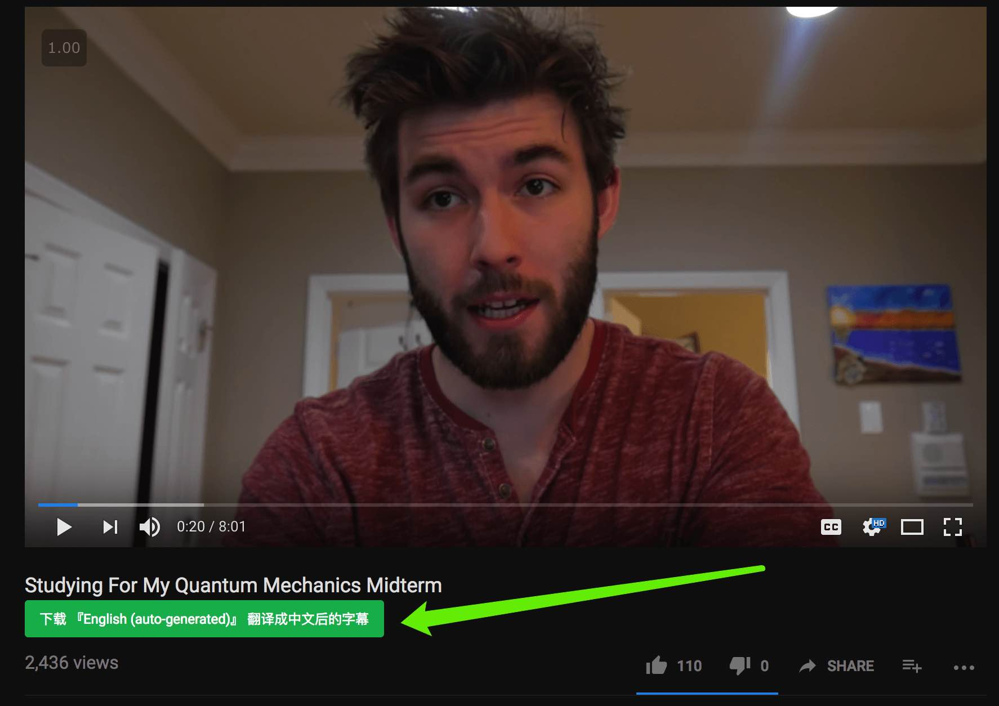

# 下载 Youtube 自动字幕翻译中文字幕

### 解决什么问题：        
Youtube 官方提供了自动字幕翻译成中文字幕的功能，   
这个脚本可以下载这个翻译成中字后的字幕文件(srt 格式)   

### Youtube 官方提供的自动字幕翻译功能，使用方法如下：

如果你希望下载这个字幕，就可以用这里的程序，，安装后一键点击即可下载。

## 安装方法
1. 安装 [Chrome 浏览器](https://www.google.com/chrome/)
2. 安装 [Tampermonkey](https://chrome.google.com/webstore/detail/tampermonkey/dhdgffkkebhmkfjojejmpbldmpobfkfo?hl=en)
3. 安装 [『Youtube 自动字幕翻译成中文后的字幕下载 v1』](https://greasyfork.org/zh-CN/scripts/39188-youtube-%E8%87%AA%E5%8A%A8%E5%AD%97%E5%B9%95%E7%BF%BB%E8%AF%91%E6%88%90%E4%B8%AD%E6%96%87%E5%90%8E%E7%9A%84%E5%AD%97%E5%B9%95%E4%B8%8B%E8%BD%BD-v1) （如下图）

## 使用演示   
下载后得到的是一个 srt 文件.   

